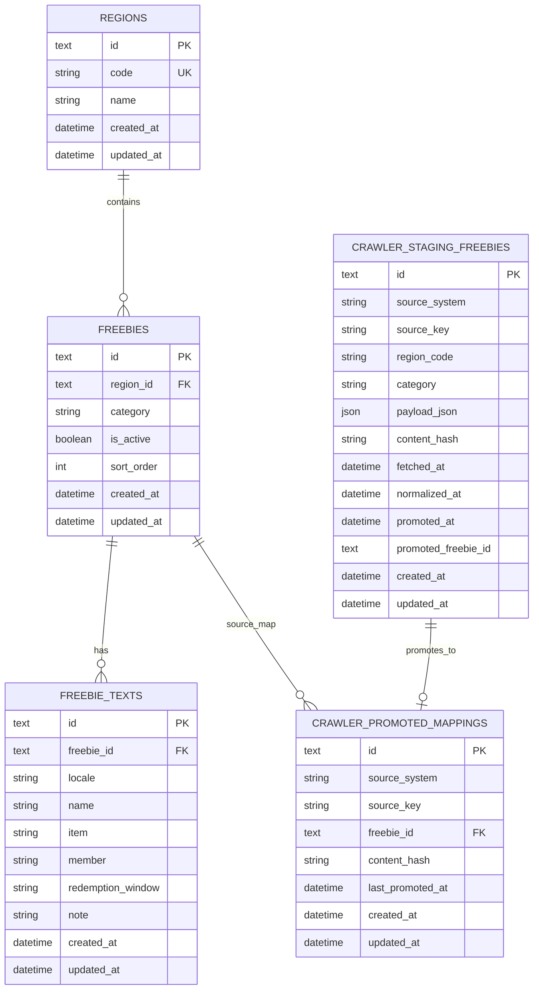

# Database Design

## Goals

- Store freebie entries in a relational database.
- Keep the schema simple enough for the current app, but flexible enough for future regions, more fields, and user features.
- Separate localized text from structural metadata so content can grow without changing the core model.

## Recommended Stack

- Database: PostgreSQL
- ORM: Prisma
- Backend runtime API: Python (FastAPI + psycopg)
- Backend tooling: Node.js (Prisma CLI, migrations, seed script, API sync script) + Python ingestion scripts

## ERD

## Table Notes

### regions

Stores the region or market grouping for a set of freebies.

Suggested columns:

- `id`: primary key
- `code`: unique stable key such as `bay_area`
- `name`: display label such as `Bay Area`
- `created_at`, `updated_at`

### freebies

Stores the structural metadata for one freebie entry.

Suggested columns:

- `id`: primary key
- `region_id`: foreign key to `regions.id`
- `category`: food, drink, dessert, beauty, etc.
- `is_active`: whether the entry should be shown
- `sort_order`: optional manual ordering
- `created_at`, `updated_at`

### freebie_texts

Stores localized text for one freebie entry.

Suggested columns:

- `id`: primary key
- `freebie_id`: foreign key to `freebies.id`
- `locale`: `en`, `zh`, etc.
- `name`, `item`, `member`, `redemption_window`, `note`
- `created_at`, `updated_at`

### crawler_staging_freebies

Stores the latest normalized crawler payload per source record before promotion.

Suggested columns:

- `id`: primary key
- `source_system`: crawler family, for example `starbucks`
- `source_key`: stable source record key, unique with `source_system`
- `region_code`: target region for downstream promotion
- `category`: normalized category used by freebies
- `payload_json`: full normalized payload snapshot
- `content_hash`: deterministic hash of payload contents
- `fetched_at`: when the crawler observed source content
- `normalized_at`: when payload normalization completed
- `promoted_at`, `promoted_freebie_id`: promotion tracking metadata
- `created_at`, `updated_at`

### crawler_promoted_mappings

Stores stable mapping from crawler source records to promoted freebies rows.

Suggested columns:

- `id`: primary key
- `source_system`, `source_key`: unique source identifier pair
- `freebie_id`: foreign key to `freebies.id`
- `content_hash`: last promoted payload hash
- `last_promoted_at`: when promotion last updated target freebie
- `created_at`, `updated_at`

## Why This Split Works

- Structural data stays stable while translations can grow independently.
- Adding a new language only requires inserting more rows into `freebie_texts`.
- Future filters like region, category, and active state stay easy to query.
- The schema stays compatible with the current frontend data shape.
- Crawler ingestion gains a traceable, idempotent path before touching user-facing data.

## Implemented Constraints

- `regions.code` is unique.
- `(freebie_id, locale)` is unique.
- `(source_system, source_key)` is unique in `crawler_staging_freebies`.
- `(source_system, source_key)` is unique in `crawler_promoted_mappings`.
- Foreign keys: `freebies.region_id -> regions.id`, `freebie_texts.freebie_id -> freebies.id`, `crawler_promoted_mappings.freebie_id -> freebies.id`.
- `category` is currently stored as a plain string; if we want stricter validation later, we can move it to an enum or lookup table.

## Current Indexes

- `regions.code` unique index
- `freebie_texts(freebie_id, locale)` unique index
- `crawler_staging_freebies(source_system, source_key)` unique index
- `crawler_promoted_mappings(source_system, source_key)` unique index

Note: Foreign key constraints exist on `freebies.region_id` and `freebie_texts.freebie_id`, but no additional non-unique indexes are explicitly created for those columns yet.

## Possible Future Indexes

Priority order based on current API query patterns:

1. `freebies(region_id, sort_order, created_at)` with `WHERE is_active = TRUE`
  - Most helpful for `GET /api/freebies`, which filters active rows, groups by region, and orders by sort/time.
2. `freebies(region_id, is_active)`
  - Useful if we keep broad list queries and want a simpler index before adding a larger composite/partial index.
3. `freebies(category)`
  - Lower priority today (no category filter endpoint yet), but valuable once category-based filtering is added.
4. `freebie_texts(locale)`
  - Lower priority for current joins; becomes useful when locale-only queries or locale-level analytics are added.
5. `crawler_staging_freebies(source_system, fetched_at)`
  - Useful for source freshness checks, historical audits, and crawler health dashboards.
6. `crawler_promoted_mappings(freebie_id)`
  - Helpful when tracing downstream freebie rows back to crawler source keys.

Note: `freebie_texts(freebie_id)` is not listed separately because the existing unique index `(freebie_id, locale)` already covers lookups by `freebie_id`.

## Possible Next Step

The schema is already created in `backend/prisma/schema.prisma`. The next step is to:

1. Add explicit query-performance indexes after measuring usage patterns (for example: partial index on `freebies(region_id, sort_order, created_at) WHERE is_active = TRUE`, then `freebies(region_id, is_active)`, then `freebies(category)`).
2. Decide whether `category` should stay a free-form string or become a stricter enum/lookup table.
3. Generalize the ingestion pipeline interface so additional brand crawlers can reuse the same stage-and-promote flow.
4. Decide whether sync script and crawler ingestion should converge into one scheduler-aware import orchestrator.

## Runtime Data Flow

The current production-style data paths are:

1. API sync path (existing):
  - Source data is prepared in `assets/data/freebies-data.js`.
  - `scripts/sync_freebies_api.js` normalizes the source data into the FastAPI write contract.
  - FastAPI persists regions, freebies, and localized text rows through write endpoints.
2. Crawler ingestion path (new):
  - Brand crawler extracts raw offer data (for example Starbucks terms).
  - Ingestion service normalizes payloads and writes/upserts `crawler_staging_freebies`.
  - Promotion step compares `content_hash` against `crawler_promoted_mappings`.
  - Changed records are promoted to `freebies` + `freebie_texts` (create or update), then mapping rows are updated.
3. Frontend runtime path:
  - The frontend reads runtime data from PostgreSQL through FastAPI read endpoints.

## Operational Notes

- `backend/prisma/seed.ts` is still useful for initial database bootstrap or full resets.
- Day-to-day content maintenance should go through the write API, sync script, or crawler ingestion pipeline, not by editing seeded data manually.
- `backend/scripts/ingest_starbucks.py` runs the Starbucks PoC ingestion flow (crawl -> stage -> promote).
- Ingestion idempotency is validated by `backend/tests/test_ingestion_starbucks.py` to ensure reruns of unchanged payloads do not duplicate promoted freebies.
- `scripts/add_bilingual_fields.js` has been retired and is no longer part of the workflow.