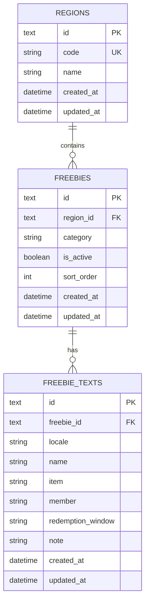

# Database Design

## Goals

- Store freebie entries in a relational database.
- Keep the schema simple enough for the current app, but flexible enough for future regions, more fields, and user features.
- Separate localized text from structural metadata so content can grow without changing the core model.

## Recommended Stack

- Database: PostgreSQL
- ORM: Prisma
- Backend runtime API: Python (FastAPI + psycopg)
- Backend tooling: Node.js (Prisma CLI, migrations, and seed script)

## ERD

## Table Notes

### regions

Stores the region or market grouping for a set of freebies.

Suggested columns:

- `id`: primary key
- `code`: unique stable key such as `bay_area`
- `name`: display label such as `Bay Area`
- `created_at`, `updated_at`

### freebies

Stores the structural metadata for one freebie entry.

Suggested columns:

- `id`: primary key
- `region_id`: foreign key to `regions.id`
- `category`: food, drink, dessert, beauty, etc.
- `is_active`: whether the entry should be shown
- `sort_order`: optional manual ordering
- `created_at`, `updated_at`

### freebie_texts

Stores localized text for one freebie entry.

Suggested columns:

- `id`: primary key
- `freebie_id`: foreign key to `freebies.id`
- `locale`: `en`, `zh`, etc.
- `name`, `item`, `member`, `redemption_window`, `note`
- `created_at`, `updated_at`

## Why This Split Works

- Structural data stays stable while translations can grow independently.
- Adding a new language only requires inserting more rows into `freebie_texts`.
- Future filters like region, category, and active state stay easy to query.
- The schema stays compatible with the current frontend data shape.

## Implemented Constraints

- `regions.code` is unique.
- `(freebie_id, locale)` is unique.
- Foreign keys: `freebies.region_id -> regions.id`, `freebie_texts.freebie_id -> freebies.id`.
- `category` is currently stored as a plain string; if we want stricter validation later, we can move it to an enum or lookup table.

## Current Indexes

- `regions.code` unique index
- `freebie_texts(freebie_id, locale)` unique index

Note: Foreign key constraints exist on `freebies.region_id` and `freebie_texts.freebie_id`, but no additional non-unique indexes are explicitly created for those columns yet.

## Possible Future Indexes

Priority order based on current API query patterns:

1. `freebies(region_id, sort_order, created_at)` with `WHERE is_active = TRUE`
  - Most helpful for `GET /api/freebies`, which filters active rows, groups by region, and orders by sort/time.
2. `freebies(region_id, is_active)`
  - Useful if we keep broad list queries and want a simpler index before adding a larger composite/partial index.
3. `freebies(category)`
  - Lower priority today (no category filter endpoint yet), but valuable once category-based filtering is added.
4. `freebie_texts(locale)`
  - Lower priority for current joins; becomes useful when locale-only queries or locale-level analytics are added.

Note: `freebie_texts(freebie_id)` is not listed separately because the existing unique index `(freebie_id, locale)` already covers lookups by `freebie_id`.

## Possible Next Step

The schema is already created in `backend/prisma/schema.prisma`. The next step is to:

1. Add explicit query-performance indexes after measuring usage patterns (for example: partial index on `freebies(region_id, sort_order, created_at) WHERE is_active = TRUE`, then `freebies(region_id, is_active)`, then `freebies(category)`).
2. Decide whether `category` should stay a free-form string or become a stricter enum/lookup table.
3. Add write-side API capabilities (create/update/deactivate freebies) when admin workflows are defined.